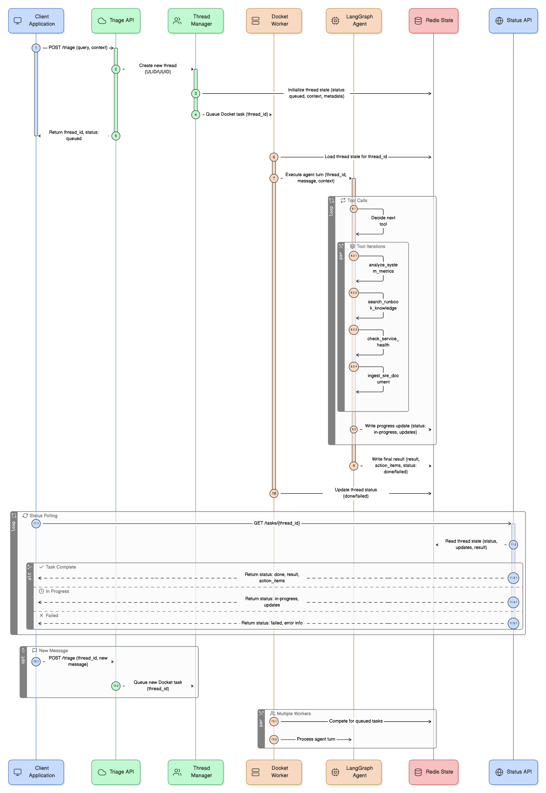

# 🧑‍🚒 Redis SRE Agent

A LangGraph-based Redis SRE Agent for intelligent infrastructure monitoring and incident response.

📖 For more details, check out our [documentation](https://redis-applied-ai.github.io/redis-sre-agent/).

## Overview

Redis SRE Agent is an AI teammate for Redis operations. It answers questions from your knowledge base and actively triages live Redis issues. It’s easy to customize to your monitoring and observability systems.

- Answers questions using your runbooks and Redis docs
- Triages problems with Redis instances by gathering signals from metrics, logs, and diganostic tools, and recommends fixes
- Fully asynchronous: runs as an asynchronous task triggered via CLI/API or schedule
- Integrations: bring your own monitoring/ticketing via providers (Prometheus, Grafana, Loki, etc.)

## Architecture

**Flow**: API/CLI → Background Task → LangGraph Agent → SRE Tools → Redis/Monitoring Systems → Large Language Model → Response as Task Result



## Quick Start

### Prerequisites
- Python 3.12+, Redis 8+ or 7.x with RediSearch module, `uv` package manager
- OpenAI API key or OpenAI-compatible proxy
- Optional: Prometheus, Loki, and Grafana access for monitoring integration

### Development Setup
```bash
# Clone and setup
git clone <repo-url>
cd redis-sre-agent

# Install dependencies
uv sync

# Environment setup
cp .env.example .env
# Edit .env with your API keys and configuration

# Start Redis 8
docker run -d -p 7843:6379 redis:8-alpine

# Start worker
uv run redis-sre-agent worker

# Start API
uv run uvicorn redis_sre_agent.api.app:app --host 0.0.0.0 --port 8000 --reload
```

### Usage

**API**:
```bash
# Detailed health check
curl http://localhost:8000/api/v1/health

# Submit a triage request (returns task_id and thread_id)
curl -X POST http://localhost:8000/api/v1/tasks \\
  -H "Content-Type: application/json" \\
  -d '{"message": "Check Redis cluster health and memory usage", "context": {"instance_id": "<instance_id>"}}'

# Check task status
curl http://localhost:8000/api/v1/tasks/{task_id}
```

## SRE Tools

The agent uses an **extensible tool system** that provides interfaces for different SRE capabilities.

For details on adding integrations and custom providers, see [Tool Providers](docs/how-to/tool-providers.md).

## Project Status

🚧 **Under Development** - Core infrastructure and basic agent workflow in progress.
Built with FastAPI, LangGraph, RedisVL, and Docket for reliable SRE automation.
