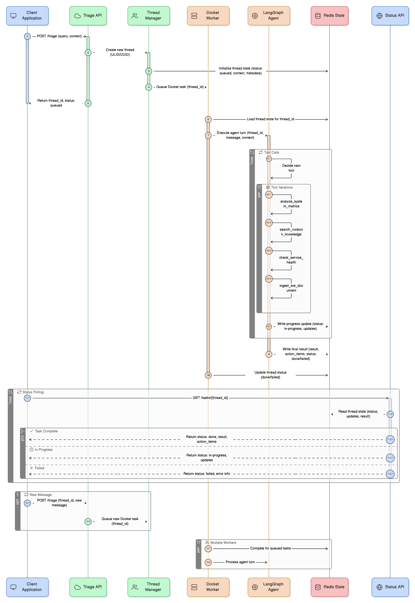

# Redis SRE Agent

Redis SRE Agent gives platform teams an AI operator for Redis. It combines your runbooks and Redis documentation with live signals from metrics, logs, support packages, and Redis diagnostics to return actionable triage with citations.

Documentation: <https://redis-applied-ai.github.io/redis-sre-agent/>

## Why Teams Use It

- Cut time from alert to first useful hypothesis.
- Give engineers one place to ask Redis questions and investigate live incidents.
- Run ad-hoc checks from the CLI or API, or schedule recurring health checks.
- Keep your existing observability stack by plugging in providers for Prometheus, Loki, Redis Enterprise, MCP servers, and custom tools.

## What It Can Do

- Answer Redis questions using ingested documentation and internal runbooks.
- Triage live Redis instances by gathering metrics, logs, and diagnostic data.
- Route work through a background worker and persist tasks, threads, and citations.
- Analyze Redis Enterprise support packages alongside live targets.
- Expose the same core capabilities through a CLI, REST API, Docker stack, and MCP server.

## Five-Minute Quickstart

### Prerequisites

- Docker with Compose v2
- OpenAI API key or compatible endpoint
- Python 3.12+ and `uv` if you want to run the CLI on your host

### Fastest Seeded Demo

```bash
git clone https://github.com/redis-applied-ai/redis-sre-agent.git
cd redis-sre-agent

cp .env.example .env
# Set OPENAI_API_KEY
# Generate REDIS_SRE_MASTER_KEY with:
# python3 -c 'import os, base64; print(base64.b64encode(os.urandom(32)).decode())'

make quick-demo
```

Ask your first question without any target setup:

```bash
docker compose exec -T sre-agent uv run redis-sre-agent \
  query "What are Redis eviction policies?"
```

Inspect the seeded demo target, then run live triage:

```bash
docker compose exec -T sre-agent uv run redis-sre-agent instance list

docker compose exec -T sre-agent uv run redis-sre-agent \
  query "Check memory pressure and slow ops" -r <instance_id>
```

### Redis Compatibility

- Redis 8.x is the recommended default for local evaluation and new deployments.
- Older Redis/Search deployments are supported when Redis Search / Redis Query Engine 2.4+ is available.

For compatibility details and fallback behavior, see [Operational Notes](docs/user_guide/how_to_guides/operations/gotchas.md#redis-enterprise-vs-redis-oss).

## Deployment Paths

- Local demo: [docs/user_guide/01_local_quickstart.md](docs/user_guide/01_local_quickstart.md)
- Full Docker walkthrough: [docs/user_guide/02_end_to_end.md](docs/user_guide/02_end_to_end.md)
- VM deployment with Redis Enterprise: [docs/user_guide/03_vm_deployment.md](docs/user_guide/03_vm_deployment.md)
- Air-gapped deployment: [docs/user_guide/how_to_guides/operations/airgap.md](docs/user_guide/how_to_guides/operations/airgap.md)

## Architecture

**Flow**: API/CLI → Background Task → LangGraph Agent → SRE Tools → Redis/Monitoring Systems → Large Language Model → Task Result + Thread History + Citations



## Current Scope

The current release ships a production-oriented core: FastAPI API, background worker, CLI, knowledge ingestion pipeline, support package workflows, Docker-based evaluation stack, and a UI for local evaluation.

Optional integrations:

- Agent Memory Server: [docs/user_guide/how_to_guides/agent_memory_integration.md](docs/user_guide/how_to_guides/agent_memory_integration.md)
  Adds fail-open long-term memory retrieval and working-memory sync for user-scoped and asset-scoped operational context.

For provider architecture and extensibility details, see [Tool Providers](docs/user_guide/how_to_guides/tool_providers.md).

## License

This software is governed by your choice of: (a) the Redis Source Available License v2 (RSALv2); or (b) the Server Side Public License v1 (SSPLv1); or (c) the GNU Affero General Public License v3 (AGPLv3). See [LICENSE.txt](LICENSE.txt) for details.
