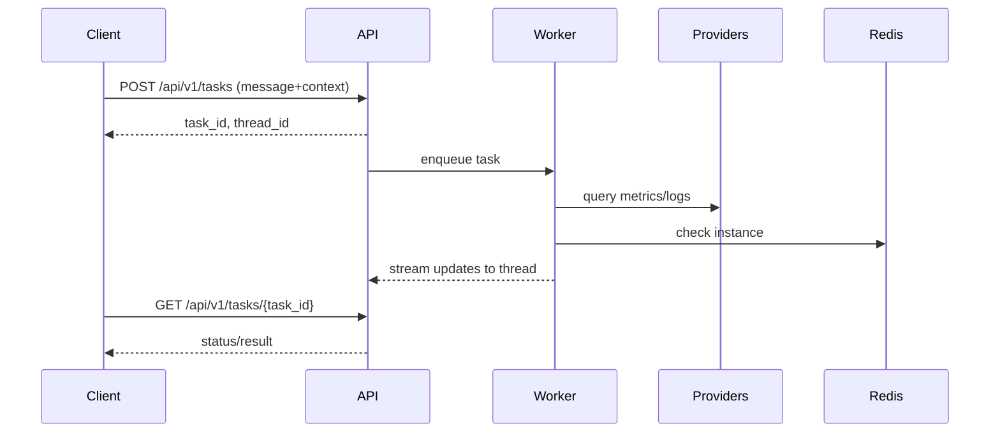

## Concepts: Core

This section explains the core ideas behind Redis SRE Agent and how pieces fit together.

---

## Agent Architecture

The system uses **three specialized agents** selected automatically based on your query and context:

| Agent | When Used | Tools Available | Use Case |
|-------|-----------|-----------------|----------|
| **Knowledge Agent** | No Redis instance linked | Knowledge base search only | General Redis questions, best practices, documentation lookup |
| **Chat Agent** | Instance linked + quick question | All tools (Redis CLI, Prometheus, Loki, etc.) | Fast, targeted queries like "check memory usage" or "show slowlog" |
| **Triage Agent** | Instance linked + comprehensive request | All tools + parallel research | Deep investigation with trigger words: "full health check", "triage", "comprehensive", "audit" |

### Automatic Routing

The router (`redis_sre_agent/agent/router.py`) uses a fast LLM (nano model) to categorize queries:

```
Query received
    │
    ├── No instance_id? ──────────────────► Knowledge Agent
    │
    └── Has instance_id?
            │
            ├── Trigger words (triage, full, comprehensive)? ──► Triage Agent
            │
            └── Quick question? ─────────────────────────────► Chat Agent
```

You can override routing via CLI (`--agent triage|chat|knowledge`) or API (`preferred_agent` in user preferences).

### Agent Details

**Knowledge Agent** (`knowledge_agent.py`)
- Searches the vector knowledge base (runbooks, docs, KB articles)
- No live system access - safe for general questions
- Fast response, single-turn conversation

**Chat Agent** (`chat_agent.py`)
- Lightweight LangGraph workflow optimized for quick Q&A
- Full tool access but simpler execution path
- Good for: "What's the current memory usage?", "Show me the slowlog", "How many connections?"

**Triage Agent** (`langgraph_agent.py`)
- Deep-research agent with parallel investigation tracks
- Breaks complex problems into multiple research topics
- Each topic runs its own tool-calling loop
- Synthesizes findings into comprehensive analysis with recommendations
- Good for: "Run a full health check", "I need comprehensive diagnostics", "Audit this instance"

---

## MCP (Model Context Protocol)

The agent supports MCP in two directions:

### 1. Agent as MCP Server (Expose to Claude/other AI)

Run the agent as an MCP server so Claude Desktop or other MCP clients can use it:

```bash
# HTTP mode (recommended for remote/Docker)
redis-sre-agent mcp serve --transport http --port 8081

# Stdio mode (for local Claude Desktop config)
redis-sre-agent mcp serve --transport stdio
```

**Available MCP tools exposed:**
- `redis_sre_deep_triage` - Start a comprehensive triage session
- `redis_sre_general_chat` - Quick Q&A with a Redis instance
- `redis_sre_database_chat` - Chat about a specific database
- `redis_sre_knowledge_query` - Query the knowledge base
- `redis_sre_knowledge_search` - Search documentation
- `redis_sre_list_instances` - List configured Redis instances
- `redis_sre_create_instance` - Register a new Redis instance
- `redis_sre_get_task_status` - Check task completion status
- `redis_sre_get_thread` - Get full results from a triage

### 2. External MCP Servers as Tool Providers

Add external MCP servers to give the agent additional capabilities:

```yaml
# config.yaml
mcp_servers:
  # Memory server for long-term agent memory
  redis-memory-server:
    command: uv
    args: ["tool", "run", "--from", "agent-memory-server", "agent-memory", "mcp"]
    env:
      REDIS_URL: redis://localhost:6399

  # GitHub MCP server
  github:
    url: "https://api.githubcopilot.com/mcp/"
    headers:
      Authorization: "Bearer ${GITHUB_PERSONAL_ACCESS_TOKEN}"
```

The agent discovers tools from configured MCP servers at startup and makes them available to the LLM during triage.

See `docs/how-to/tool-providers.md` for more on the tool system.

---

## Tasks vs. Threads

- **Task**: How you interact with the agent. Create a task to run a query or triage. Each task has a `task_id` and tracks execution status (queued, running, completed, failed).
- **Thread**: What happened during execution. Contains the conversation history, messages, tool calls, and results. Each thread has a `thread_id`.

When you create a task, the API creates or reuses a thread to store the execution history. You can:
- Poll the task for status: `GET /api/v1/tasks/{task_id}`
- Read the thread for results: `GET /api/v1/threads/{thread_id}`
- Stream updates via WebSocket: `ws://localhost:8080/api/v1/ws/tasks/{thread_id}` (Docker Compose) or port 8000 (local)

---

## Jobs

- **Ad-hoc jobs**: On-demand via CLI or API. Each run creates a task and streams results to a thread.
- **Scheduled jobs**: Recurring health checks defined by schedules. Each execution produces a task and posts into the same thread.

---

## Instances and Context

- Create instance records with `instance create` (CLI) or `POST /api/v1/instances` (API)
- Provide `instance_id` in your query to trigger live triage with tools
- Instance metadata (environment, usage, description) helps the agent understand context

---

## Providers (Integrations)

Pluggable integrations for metrics (Prometheus), logs (Loki), tickets (GitHub/Jira), clouds, and more.
Configure via environment. See: `docs/how-to/tool-providers.md`

---

## Security and Secrets

Use a 32-byte master key for envelope encryption of secrets at rest.
See: `docs/how-to/configuration/encryption.md`

---

## Diagrams

### Agents, Routing & Providers
```mermaid
flowchart LR
  User[User/Caller]
  Router[Router]
  KA[Knowledge Agent]
  CA[Chat Agent]
  TA[Triage Agent]
  KB[(Knowledge Base)]
  Prov[Providers\n(Prometheus/Loki/MCP)]
  Redis[(Target Redis)]

  User --> Router
  Router -->|No instance| KA
  Router -->|Quick question| CA
  Router -->|Full triage| TA

  KA --> KB
  CA --> KB
  CA --> Prov
  CA --> Redis
  TA --> KB
  TA --> Prov
  TA --> Redis
```

### Diagram: Threads & Tasks lifecycle (simplified)

