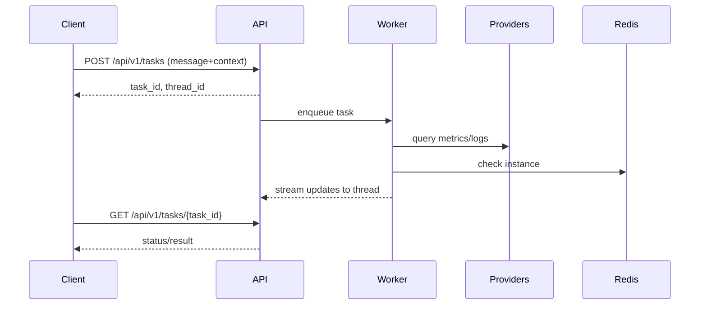

## Concepts: Core

This section explains the core ideas behind Redis SRE Agent and how pieces fit together.

- **Query modes**
  - **Without an instance_id**: Get knowledge-based advice from your ingested docs, runbooks, and wikis. The agent searches the knowledge base and provides general guidance without touching live systems.
  - **With an instance_id**: Get live triage of a specific Redis instance. The agent uses configured providers (Prometheus, Loki, Redis CLI, etc.) to fetch metrics, logs, and diagnostics, then analyzes the instance state.

  Note: Internally, these use different agent implementations (Knowledge Agent vs. Triage Agent), but you'll sometimes see those names in output or logs.

- **How the triage agent works**

  When you provide an instance_id, the agent uses a deep-research approach:

  1. **Initial triage**: Analyzes your query and the instance context to identify what needs investigation
  2. **Research decomposition**: Breaks the investigation into parallel research topics (e.g., "check memory pressure", "analyze slow operations", "review replication lag")
  3. **Parallel research tracks**: Each topic runs in its own tool-calling loop, using providers (Prometheus, Loki, Redis CLI, etc.) to gather data
  4. **Synthesis**: Combines findings from all research tracks into a coherent analysis with actionable recommendations

  This parallel research design allows the agent to investigate multiple aspects of an issue simultaneously, making triage faster and more thorough.

- **Tasks vs. Threads**

  - **Task**: How you interact with the agent. Create a task to run a query or triage. Each task has a `task_id` and tracks execution status (queued, running, completed, failed).
  - **Thread**: What happened during execution. Contains the conversation history, messages, tool calls, and results. Each thread has a `thread_id`.

  When you create a task, the API creates or reuses a thread to store the execution history. You can:
  - Poll the task for status: `GET /api/v1/tasks/{task_id}`
  - Read the thread for results: `GET /api/v1/threads/{thread_id}`
  - Stream updates via WebSocket: `ws://localhost:8080/api/v1/ws/tasks/{thread_id}` (Docker Compose) or port 8000 (local)

- **Jobs**
  - Ad-hoc jobs: On-demand via CLI or API. Each run creates a task and streams results to a thread.
  - Scheduled jobs: Recurring health checks defined by schedules. Each execution produces a task and posts into the same thread.

- **Instances and Context**
  - Create instance records with `instance create` (CLI) or `POST /api/v1/instances` (API)
  - Provide `instance_id` in your query to trigger live triage with tools
  - Instance metadata (environment, usage, description) helps the agent understand context

- Providers (Integrations)
  - Pluggable integrations for metrics (Prometheus), logs (Loki), tickets (GitHub/Jira), clouds, and more.
  - Configure via environment. See: how-to/tool-providers.md

- Security and Secrets
  - Use a 32-byte master key for envelope encryption of secrets at rest.
  - See: how-to/configuration/encryption.md


### Diagram: Agents & Providers (high-level)
```mermaid
flowchart LR
  User[User/Caller]
  KA[Knowledge Agent]
  TA[Triage Agent]
  KB[(Knowledge Base)]
  Prov[Providers\n(Prometheus/Loki/etc.)]
  Redis[(Target Redis)]

  User -->|Ask| KA
  KA --> KB

  User -->|Triage| TA
  TA --> Prov
  TA --> Redis
```

### Diagram: Threads & Tasks lifecycle (simplified)

