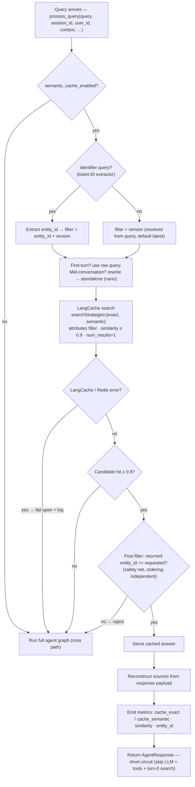
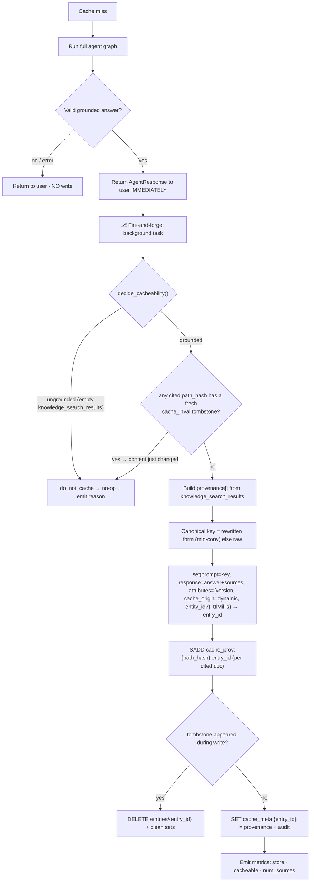

# Design: Semantic Answer Cache (LangCache) for the Knowledge Agent

**Status:** Draft for review (revised after consensus review) · **Scope:** knowledge-only agent (`process_query`, `redis_sre_agent/agent/knowledge_agent.py:514`) · **Code changes:** none yet (design only)
**Backend:** Redis **LangCache** (managed) + the project's existing Redis
**Supersedes:** the prior redisvl `SemanticCache` draft.

> **Revision note:** A Planner→Architect→Critic consensus review verified this doc against the codebase and the LangCache API spec (`redis-docs/.../langcache/api-reference/api.yaml`). This revision corrects the grounding defects it found: the `source_document_path` join-key gap, the fictional `process_query(version)` signature, the false "feedback eviction already implemented" claim, the nonexistent `is_case_specific`/PII router, the sliding-TTL contradiction, and the unverified "filter-before-similarity" guarantee. Items that depend on unbuilt work are now in **§0 Prerequisites**; unverified vendor behavior is in **§P Open spikes**.

---

## 0. Prerequisites & small pre-work

**`source_document_path` is implemented** (verified). It is written to the document hash at ingestion (`document_processor.py:165`) and drives the existing source-tracking / `path_hash` machinery (`deduplication.py:64-66`, keyed `sre_knowledge_meta:source:{path_hash}` in `core/keys.py`). The `.omc/specs/deep-interview-source-document-path.md` spec is **completed work that simply hasn't been deleted — not a blocker.**

One small cache-side change remains so the field reaches the agent at query time:

1. **Add `source_document_path` to `_SEARCH_RETURN_FIELDS`** (`core/knowledge_helpers.py:42`) and include it in the serialized search-result dict (`:1419`). RediSearch `RETURN` can return a hash field that is **not** in the index schema, so **no schema change and no re-index are required** — the field already exists on the hashes. (Confirm the live corpus was ingested after the feature landed; re-ingest only any docs that predate it.)

Once that lands, `path_hash = sha256(source_document_path)[:16]` is computable from `state["knowledge_search_results"]` (`knowledge_agent.py:410`) and the reverse index (§C.2/§G) works.

**Version (fully supported — not a blocker).** The schema has a `version` field (`core/redis.py` `_build_document_schema`) and search filters on it (`_tag_equals_expression("version", version)` at `knowledge_helpers.py:333`, plus `_doc_matches_requested_version` at `:164`). v1 caches **both `latest` and pinned versions** (`7.8`, `7.4`, …). Storing a `version` attribute on the cache entry is trivial. The only design point: the cache lookup runs at the *top* of `process_query`, before retrieval, so the **request version is resolved at lookup time** — extract it from the query (the repo already has version helpers like `_extract_version_from_source`; a query-text version detector is a small add) and default to `latest`.

---

## A. Executive summary

Put a single, global, flag-gated **semantic answer cache** in front of the knowledge agent. On a sufficiently-similar prior question it returns the previously synthesized answer and **short-circuits the entire LangGraph run** — skipping the LLM loop, the tools, and the forced turn-0 `knowledge_search` (`tool_choice="required"` at `knowledge_agent.py:248-249`).

- **Backend is managed LangCache** — it owns embeddings, the vector index, similarity search, store-time TTL, and scalar attribute filters. Fan-out (one document → many entries) and rich provenance live in **our own Redis**.
- **Provenance-based push invalidation** keyed on `source_document_path` (via a `path_hash` reverse index we maintain). Requires §0.
- **Lookup via LangCache native `searchStrategies`** (`exact` then `semantic`) plus mid-conversation query rewriting; not a hand-rolled two-stage scheme (see §D).
- **Tickets, skills, and docs are all cacheable.** There is **no tenant/user authorization model** today, so a global cache has no cross-tenant leak vector (§K). The only hard write exclusion is *ungrounded* answers.
- **Identifier queries are scoped by an `entity_id` attribute** with a **post-filter safety net** (correct regardless of LangCache's internal filter ordering).
- **Fixed store-time TTL** (no sliding/refresh-on-hit — LangCache exposes no read-extend op). Correctness comes from push invalidation; TTL is a bounded backstop.
- **Async write** — fire-and-forget after the response returns; never adds user-facing latency. A tombstone recheck guards the write-vs-invalidate race (§H).

Ships **default-OFF** behind `semantic_cache_enabled`, after §0, validated on the live local stack and the eval harness.

---

## B. Architecture: where things live

```
┌─────────────────────────── LangCache (managed) ───────────────────────────┐
│  one entry per stored answer                                                │
│  • prompt          canonical/rewritten question  (LangCache embeds this)    │
│  • response        answer + inline source citations (JSON string)           │
│  • attributes      version · cache_origin · entity_id   (≤ 5 attrs allowed) │
│  • ttlMillis       fixed at store time (short for latest)                   │
│  • entry_id        returned by the set call                                 │
└─────────────────────────────────────────────────────────────────────────┘
              │ entry_id                          ▲ path_hash → entry_ids
              ▼                                    │
┌──────────────────────── Our Redis (existing instance) ────────────────────┐
│  cache_prov:{path_hash}   →  SET of entry_ids     (reverse index)          │
│  cache_meta:{entry_id}    →  JSON  (full provenance + audit, debug only)   │
│  cache_inval:{path_hash}  →  short-TTL tombstone  (write-vs-invalidate)    │
└─────────────────────────────────────────────────────────────────────────┘
```

`ToolCache` (exact-match memoization of individual tool calls within a run) is unchanged and complementary; the semantic cache sits above the graph and is checked first.

**Invalidation primitives (verified in `api.yaml`):** LangCache supports `DELETE /entries/{entryId}` (`:243`), `deleteQuery` by attributes (`:168`), and `flush` (`:316`) — so per-entry, coarse, and full clears are all available.

---

## C. Data model

### C.1 LangCache entry

**Core:** `prompt` (canonical/rewritten question, embedded by LangCache), `response` (answer + source citations as JSON), `entry_id` (returned by the set call), `ttlMillis` (fixed at store time).

**Attributes** (declared at cache creation, immutable; **max 5**, names `^[a-zA-Z0-9_-]{1,32}$`, values no-comma and ≤500 chars — `api.yaml:489-499`):

| Attribute | Example | Role |
|---|---|---|
| `version` | `latest` / `7.8` | lookup filter — request version resolved from the query (§0); v1 caches latest + pinned. |
| `cache_origin` | `dynamic` / `curated` | generated vs pre-warmed (warming is Phase 2). Declared now to avoid a rebuild. |
| `entity_id` | `RET-4421` | exact identifier scope for identifier queries (§I). |

3 of 5 attributes used; values must be comma-free (ticket IDs qualify). **Removed:** `embedding_model_version` (LangCache-managed), `source_ids` (→ reverse index — LangCache has no multi-value/`contains` filter), `index_origin` (reverse index does fine-grained invalidation strictly better; content-type observability comes from `cache_meta.provenance[].index`).

### C.2 Reverse index (invalidation)

```
cache_prov:{path_hash}  →  SET { entry_id, … }
```
`path_hash = sha256(source_document_path)[:16]` — the **same hash ingestion uses** (`deduplication.py:66`, `knowledge_pack/loader.py:208`, keyed `sre_knowledge_meta:source:{path_hash}` in `core/keys.py`), so the invalidation signal and the cache speak one identifier with no translation. Written `SADD cache_prov:{path_hash} {entry_id}` per cited doc; read `SMEMBERS → DELETE /entries/{entry_id}` on change. **Depends on §0** (source_document_path must reach `knowledge_search_results`).

### C.3 Side metadata (debug / audit)

`cache_meta:{entry_id}` → JSON: `provenance[]` (`source_document_path`, `path_hash`, `index`, `title`, `doc_version`, `document_hash`, `chunk_indices`), plus `original_question`, `rewritten_question`, `tools_invoked`, `version`, `model`, `generated_at` (also answers "how long cached?"), `thread_id`, `num_sources`. Not on the serve path (sources for serving ride in the `response`).

### C.4 Relationships

`cache_meta.provenance[]` is the source of truth; `cache_prov` sets, `entity_id`, and `version` are projections computed at store time. **Three structures, three jobs:** LangCache = match + serve; reverse index = invalidate; side-blob = debug/audit.

---

## D. Read / lookup path



**Notes:**

1. **Native `searchStrategies`.** LangCache accepts an ordered strategy array `[exact, semantic]` (`api.yaml:421-425,544-551`) in a single call — exact-match first, semantic fallback. We use that instead of a hand-rolled two-stage scheme. Verbatim repeats resolve via the `exact` strategy; paraphrases via `semantic`.
2. **Rewriting is mid-conversation only.** First-turn queries use the raw text (no rewrite); mid-conversation queries are rewritten to standalone form via `nano` (§F). The rewrite is reused as the store key on a miss. (Note: `exact` strategy matches a *first-turn* raw repeat against a first-turn stored key; a mid-conversation repeat relies on `semantic` against the stored rewritten key.)
3. **`version` filter** — the request version is resolved from the query at lookup time (default `latest`); both `latest` and pinned versions (`7.8`, …) are cached and filtered (§0).
4. **Post-filter safety net.** After a candidate hit, verify the returned entry's `entity_id` equals the requested one before serving (treat mismatch as a miss). This makes identifier safety hold **regardless of whether LangCache pre- or post-filters** — see §P.
5. **Threshold 0.9** (LangCache *similarity*, higher = stricter). Re-validate on LangCache's embedding model.
6. **Fail open with logging** — any error → miss → full graph; structured log (never the raw prompt) + `cache_error_fallthrough` metric.
7. **Trust-on-read freshness** — push invalidation (§G) prunes stale entries; the fixed TTL bounds the residual window (incl. the write-vs-invalidate race, §H).
8. **No TTL refresh on hit** — LangCache has no read-extend op (§P); TTL is fixed at store time.

---

## E. TTL (fixed, no sliding window)

LangCache `ttlMillis` is set **at store time only**; there is no read-extend/refresh operation (`api.yaml` — verified). So TTL is **fixed and absolute**, not a sliding window:

- **`version="latest"`** → **short TTL** (e.g. 1h) — `latest` is a moving pointer; this bounds the in-flight-ingest + write-vs-invalidate-race window.
- **pinned versions** (`7.8`, `7.4`, …) → **longer TTL** (e.g. 24h) — content is stable.

TTL is a backstop only; correctness comes from push invalidation. A hard absolute max-age beyond this is unnecessary because TTL is already absolute. (The earlier "sliding window refreshed on hit" idea was dropped: faking it via re-store would mint a new `entry_id` and orphan the reverse index, making hot stale entries un-invalidatable.)

---

## F. Query rewriting (contextualization)

Contextualization — resolving a context-dependent question into standalone form — not paraphrase-matching (LangCache handles paraphrases semantically).

- **Model:** `openai_model_nano` (cheapest tier; `create_nano_llm` / `nano` tier, `llm_helpers.py:247,409,433`; `config.py:340`).
- **When:** mid-conversation only; first-turn skips it (zero LLM cost on the common path). Computed once, reused as the store key.
- **Must-keep tokens (preserve verbatim, never paraphrase):** versions (`7.8`, `latest`), config directives (`maxmemory`, `maxmemory-policy`, `appendonly`), commands (`CONFIG SET`, `BGREWRITEAOF`), error/log tokens (`MISCONF`, `OOM`), metric names, identifiers, paths, flags, quoted strings.
- **Hard rule:** never introduce a version/environment/edition the user didn't state (a hallucinated version → silent wrong-version entry).
- **Fallback:** already self-contained → unchanged; insufficient context → append terms or skip caching this turn.

---

## G. Invalidation

**Primary — push, per-document (surgical).** At ingestion job completion, for each document **replaced or removed** (the dedup layer distinguishes this from a pure add — `deduplication.py:518-572`), emit its `path_hash` → `SMEMBERS cache_prov:{path_hash}` → `DELETE /entries/{entry_id}` each → clean the set, and write a short-TTL tombstone `cache_inval:{path_hash}` (for the write race, §H). Covers docs, runbooks, skills, tickets uniformly; automatically version-correct (the `7.8` and `latest` paths hash differently). **Depends on §0.**

- **Pure adds do not invalidate.** A manual clear lever stays for "make new content live now."
- **Coarse / break-glass:** `deleteQuery` by attribute (e.g. `entity_id` for a single changed ticket); `flush` for a full clear (all API-supported).
- **TTL** is the passive backstop (§E).
- **Feedback-driven eviction is Phase 2** (§J) — not in v1. (The feedback signal exists at `core/feedback.py`, but no cache eviction is wired, and the cache doesn't exist yet.)

---

## H. Write / miss path



**Notes:**

1. **Error/ungrounded → no write.** Only successful **grounded** answers are stored. Ungrounded (empty `knowledge_search_results`) is the **only** hard exclusion — verified as a valid signal (`knowledge_agent.py:410`).
2. **Async, fire-and-forget.** Returns before writing; fails silently + logs (`cache_store_error`).
3. **Write-vs-invalidate race mitigation.** Invalidation writes a short-TTL `cache_inval:{path_hash}` tombstone. The write checks for a fresh tombstone **before** storing (skip if the content just changed) and **rechecks after** `SADD` (undo if a tombstone appeared during the write window). This closes the race the async write would otherwise open; residual exposure is bounded by the TTL regardless.
4. **`entity_id` extraction is NET-NEW work** — see §I; the existing predicates are inadequate.
5. **Canonical-key invariant** — store under the same form the lookup uses.

---

## I. Identifier handling (`entity_id`)

Identifier queries need an **exact** identifier match (`RET-4421` ≠ `RET-4422`) but **paraphrase** reuse for the same ID. Approach: semantic match **scoped by an `entity_id` attribute filter**, plus a **post-filter safety net** (§D note 4) so correctness does not depend on LangCache's internal filter ordering (§P).

**The only entity type for this cache is the support-ticket ID.** Instance/cluster IDs are a diagnostic-agent (live-targeting) concept and are **not extracted anywhere in the knowledge path** (no instance/cluster patterns in `knowledge_helpers.py` or `knowledge_agent.py`) — so they are **out of scope** for the knowledge cache. Add a typed pattern later only if knowledge queries are found to carry them.

**Why extraction is net-new (can't reuse the existing gate).** The only identifier detector is `_looks_like_support_ticket_identifier` (`knowledge_helpers.py:833`), which is **shape-only**: no spaces, matches the catch-all `_SUPPORT_TICKET_ID_RE` (`^[A-Za-z0-9][A-Za-z0-9._:-]{1,127}$`), and contains a digit. That shape cannot distinguish a version from a ticket ID, so `7.8` is classified as an identifier (verified). Reusing it would write `7.8` into `entity_id` — wrong, because **version is a separate axis** (the `version` lookup filter, not an entity).

**v1 extraction = three pieces, version-first precedence:**

1. **Query-text version detector (new).** Match version mentions in the query — `7.8`, `v7.8`, "version 7.2", "in 7.4" — and route them to the **`version` attribute** (§0). (`_SOURCE_VERSION_RE = /(\d+\.\d+)/` only reads version from doc *source paths* today, not query text, so this is new.) These tokens are **claimed by the version axis and removed from entity consideration.**
2. **Tight ticket-ID pattern (new).** Replace the catch-all regex with the real ticket format (e.g. `[A-Z]{2,}-\d+` → `RET-4421`) → `entity_id`. This alone excludes `7.8`, `maxmemory`, `OOM`, and any bare digit-bearing token.
3. **Precedence rule.** Version is matched first; a token becomes `entity_id` **only if** it matches the specific ticket-ID format **and** is not a version. Non-identifier queries take the general semantic path (no `entity_id` filter; version filter only).

No PII detection exists and none is required (no authz/privacy model today, §K) — there is no PII `do_not_cache` gate in v1.

---

## J. Deferred to Phase 2 / later

- **Feedback-driven eviction** — wire `evict_cache(query)` into the existing `core/feedback.py` signal. Net-new; not v1.
- **Multi-version support** — plumb a per-query `version` into `process_query` (it has none today); then activate per-version filtering + latest-vs-pinned TTL tiering.
- **Curated warming / pre-warm** — **Phase 2, not designed yet.** Only v1 obligation: `cache_origin` declared up front so warming needs no rebuild.
- **Multi-entity queries** — one holistic answer can't be represented by a single-valued `entity_id`. v1: not served, not stored. Phase 2: decompose into per-entity sub-queries + partial-hit synthesis.
- **Concurrent first-askers (stampede)** — two simultaneous misses both run the loop and store. v1: accept (cost, not correctness). Phase 2: single-flight lock (`SET cache_lock:{prompt_hash} NX EX 30`) with run-anyway fallback.
- **Multi-value `entity_id`** — blocked on both LangCache multi-value support (unconfirmed) and the no-comma value rule. Until then, decomposition handles multi-entity.
- **Chunk-level invalidation** — finer than per-document; `chunk_content_hashes` captured in `cache_meta` from day one so it's a pure add later.

---

## K. Configuration & authorization

Env-agnostic single config set (deploy injects per-environment values); fits the project's pydantic-settings style (no env prefix, `SecretStr` for secrets — `config.py:263,284`):

```python
semantic_cache_enabled: bool = Field(default=False)              # default OFF (and gated on §0)
semantic_cache_similarity_threshold: float = Field(default=0.9)  # LangCache similarity
semantic_cache_ttl_latest_ms: int = Field(default=60 * 60 * 1000)        # 1h (v1 default)
semantic_cache_ttl_pinned_ms: int = Field(default=24 * 60 * 60 * 1000)   # 24h (multi-version, later)
langcache_api_url: str = Field(...)
langcache_cache_id: SecretStr = Field(...)
langcache_api_key: SecretStr = Field(...)
langcache_server_url: str = Field(default="https://aws-us-east-1.langcache.redis.io")
```

**Authorization:** there is **no tenant/user/role authorization model** in the knowledge path today. A global, ACL-free answer cache therefore has **no cross-tenant leak vector** — tickets and skills are cacheable globally. If an authz/tenancy model is ever introduced, this design must be revisited (a per-tenant scope or a separate cache).

**Ops prerequisites:** create the attributes (`version`, `cache_origin`, `entity_id`) on each LangCache service **before first deploy** (immutable after creation); confirm the 5-attribute / no-comma-value constraints.

---

## L. Observability & kill switch

- **Tiered metrics:** `cache_exact`, `cache_semantic`, `cache_miss`; store rate, `do_not_cache` reason counts, tokens/latency saved, `cache_error_fallthrough`, `cache_store_error`, post-filter-reject count.
- **Content-type mix** derived from `cache_meta.provenance[].index`.
- **Never log raw prompts** (hash them — mirror the existing `query.sha1` pattern).
- **Fail open, loudly** — every error path treats the cache as absent and logs structurally.
- **Kill switch:** `semantic_cache_enabled=false` disables **serve and store**; **push invalidation still runs** so stale entries are cleaned while serving is off.

---

## M. Decisions log

1. ✅ Backend = managed LangCache.
2. ✅ Lookup via native `searchStrategies:[exact, semantic]` + mid-conversation rewriting (not a hand-rolled two-stage scheme).
3. ✅ Provenance push invalidation via a `path_hash → {entry_id}` reverse index. **Gated on §0.**
4. ✅ Tickets + skills + docs cacheable; only *ungrounded* answers are `do_not_cache`. **No authz model exists**, so no cross-tenant vector (§K).
5. ✅ Identifier queries scoped by `entity_id` (support-ticket IDs only; instance/cluster out of scope) + a post-filter safety net. Extractor is **net-new**: tight ticket-ID pattern + separate query-version detector, **version-first precedence** (§I).
6. ✅ **Fixed store-time TTL** (no sliding/refresh — no LangCache read-extend op). `latest` short TTL; pinned versions longer.
7. ✅ Similarity threshold 0.9 (re-validate on LangCache).
8. ✅ Rewrite via `nano`, mid-conversation only; constrained rewriting.
9. ✅ Async write; error/ungrounded skip the write; tombstone recheck for the write-vs-invalidate race.
10. ✅ Kill switch disables serve/store, keeps push invalidation.
11. ✅ Removed `index_origin`, `source_ids` (→ reverse index), `embedding_model_version`.

**Deferred to Phase 2:** feedback eviction, multi-version, warming, multi-entity, concurrent-first-asker single-flight, multi-value `entity_id`, chunk-level invalidation (§J).

---

## N. Testing & rollout

**Prerequisite gate:** the live-stack/invalidation tests require the §0 return-field change (so `source_document_path` reaches search results); version supports `latest` + pinned. State this in the test plan.

- **Unit:** `decide_cacheability` truth table (ungrounded → skip; grounded doc/skill/ticket → cache); tombstone-skip and post-`SADD` undo on the write race; `entity_id` extractor (rejects `7.8`, accepts `RET-4421`); post-filter rejects an `entity_id` mismatch; canonical-key consistency between store and lookup; fail-open on simulated LangCache error.
- **Spike tests (§P) before relying on the guarantees:** (a) does an `entity_id` attribute filter actually prevent cross-serving `RET-4421`/`RET-4422` (pre- vs post-filter)? — the post-filter net should make the answer "safe either way"; (b) confirm `searchStrategies:[exact, semantic]` semantics on the literal prompt.
- **Live stack (post-§0):** ask a question twice → 2nd is a hit, no LLM/tool spans; change a doc → reingest → confirm citing entries dropped (reverse index); two different tickets → confirm no cross-serve.
- **Eval:** `make test` then `make test-eval-pr`; tune the threshold against **numeric targets** — record hit-rate and false-hit-rate; gate "loosen threshold" on false-hit-rate ≈ 0.
- **Phased:** complete §0 → land wrapper + hooks flag-OFF → spikes (§P) → enable in dev, validate on live stack + evals → default-ON after sign-off.

---

## P. Open spikes (unverified vendor behavior — confirm before relying)

1. **Attribute filter ordering.** `api.yaml` says attributes "can be used for filtering when searching" but does **not** state whether filtering is a hard pre-filter (before vector scoring) or a post-filter on top-k. The §D **post-filter safety net** makes identifier correctness hold either way, but confirm the performance/recall implication.
2. **`searchStrategies` semantics.** Confirm `exact` operates on the literal prompt string and that `[exact, semantic]` priority behaves as expected in one call.
3. **TTL.** Confirmed no read-extend op exists; confirm default-cache-TTL behavior when `ttlMillis` is omitted.
4. **Attribute constraints.** Confirmed max 5 / name pattern / no-comma values (`api.yaml:489-499`); confirm at cache-provisioning time.
