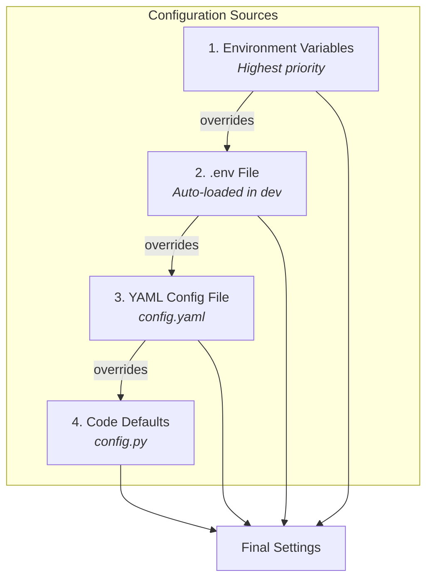

## Configuration

This guide explains how the Redis SRE Agent is configured, what the required and optional settings are, and how to override tool providers. For defaults, see [`redis_sre_agent/core/config.py`](https://github.com/redis-applied-ai/redis-sre-agent/blob/main/redis_sre_agent/core/config.py) and [`.env.example`](https://github.com/redis-applied-ai/redis-sre-agent/blob/main/.env.example).

### Sources and precedence

Configuration values are loaded from these sources (highest precedence first):

1. Environment variables (recommended for prod)
2. `.env` file (loaded automatically in dev if present)
3. **YAML config file** (for complex nested configurations like MCP servers)
4. Code defaults in `redis_sre_agent/core/config.py`



For example, if `REDIS_URL` is set in both `.env` and as an environment variable, the environment variable wins.

### YAML configuration

For complex nested settings like MCP server configurations, you can use a YAML config file. This is particularly useful for configuring multiple MCP servers with tool descriptions.

**Config file discovery order:**

1. Path specified in `SRE_AGENT_CONFIG` environment variable
2. `config.yaml` in the current working directory
3. `config.yml` in the current working directory
4. `sre_agent_config.yaml` in the current working directory
5. `sre_agent_config.yml` in the current working directory

**Example `config.yaml`:**

```yaml
# Application settings
debug: false
log_level: INFO

# MCP (Model Context Protocol) servers configuration
mcp_servers:
  # Memory server for long-term agent memory
  redis-memory-server:
    command: uv
    args:
      - tool
      - run
      - --from
      - agent-memory-server
      - agent-memory
      - mcp
    env:
      REDIS_URL: redis://localhost:6399
    tools:
      search_long_term_memory:
        description: |
          Search saved memories about Redis instances. ALWAYS use this
          before troubleshooting to recall past issues and solutions.
          {original}

  # GitHub MCP server (remote) - uses GitHub's hosted MCP endpoint
  # Requires a GitHub Personal Access Token with appropriate permissions
  # Uses Streamable HTTP transport (default for URL-based connections)
  github:
    url: "https://api.githubcopilot.com/mcp/"
    headers:
      Authorization: "Bearer ${GITHUB_PERSONAL_ACCESS_TOKEN}"
    # transport: streamable_http  # default, can also be 'sse' for legacy servers
```

See `config.yaml.example` for a complete example with all available options.

**Using a custom config path:**

```bash
export SRE_AGENT_CONFIG=/path/to/my-config.yaml
```

### Required

- `OPENAI_API_KEY`: Your OpenAI API key

### Common optional settings

- `REDIS_URL`: Agent operational Redis (default: `redis://localhost:7843/0`)
- `PROMETHEUS_URL` / `GRAFANA_URL`: Optional app-level URLs for integrations
- `TOOLS_PROMETHEUS_URL` / `TOOLS_LOKI_URL`: Tool-specific endpoints
- `API_KEY`: API auth key (if you enable auth)
- `ALLOWED_HOSTS`: CORS origins (default: `["*"]`)

Example `.env` (local):

```bash
OPENAI_API_KEY=your_openai_key
REDIS_URL=redis://localhost:7843/0
# Optional tool endpoints
TOOLS_PROMETHEUS_URL=http://localhost:9090
TOOLS_LOKI_URL=http://localhost:3100
```

### Tool caching

The agent caches tool call outputs in Redis to avoid repeated calls with the same arguments. Caching is enabled by default and can be configured globally or per-tool.

#### Configuration options

| Setting | Environment Variable | Default | Description |
|---------|---------------------|---------|-------------|
| `tool_cache_enabled` | `TOOL_CACHE_ENABLED` | `true` | Enable/disable caching globally |
| `tool_cache_default_ttl` | `TOOL_CACHE_DEFAULT_TTL` | `60` | Default TTL in seconds for tools without specific TTLs |
| `tool_cache_ttl_overrides` | `TOOL_CACHE_TTL_OVERRIDES` | `{}` | Per-tool TTL overrides |

#### Per-tool TTL overrides

Override cache TTLs for specific tools by mapping tool name patterns to TTL values in seconds.

**Environment variable (JSON format):**

```bash
# Maps tool name patterns to TTL in seconds
# "info" -> 120 seconds, "slowlog" -> 30 seconds, "config_get" -> 600 seconds
TOOL_CACHE_TTL_OVERRIDES='{"info": 120, "slowlog": 30, "config_get": 600}'
```

**YAML config:**

```yaml
# Maps tool name patterns to TTL in seconds
tool_cache_ttl_overrides:
  info: 120        # Cache INFO results for 2 minutes
  slowlog: 30      # Cache slowlog for 30 seconds
  config_get: 600  # Cache config for 10 minutes (rarely changes)
```

**Partial matching:** Tool names are matched using substring search. For example, `"info"` matches any tool containing "info" in its name, such as `redis_command_abc123_info` or `cluster_info`. This is necessary because tool names include instance-specific hashes (e.g., `redis_command_abc123_info`) that vary per Redis instance.

#### Built-in TTL defaults

Some tools have sensible defaults defined in `DEFAULT_TOOL_TTLS`:

| Tool | TTL (seconds) | Rationale |
|------|---------------|-----------|
| `info` | 60 | Redis INFO output |
| `memory_stats` | 60 | Memory statistics |
| `config_get` | 300 | Config rarely changes |
| `slowlog` | 60 | Recent slow queries |
| `client_list` | 30 | Client connections change frequently |
| `knowledge_search` | 300 | Knowledge base content |
| `prometheus_query` | 30 | Metrics |

#### TTL resolution priority

1. User-defined overrides (`tool_cache_ttl_overrides`)
2. Built-in defaults (`DEFAULT_TOOL_TTLS`)
3. Global default (`tool_cache_default_ttl`)

### Tool providers

Providers are loaded by the `ToolManager` based on:

- **Without an instance**: Knowledge base and basic utilities (date conversions, calculator)
- **With an instance**: All of the above plus the providers configured in `settings.tool_providers` (env: `TOOL_PROVIDERS`)
- **Conditional providers**: Additional providers based on instance type (Redis Enterprise admin, Redis Cloud)

Override provider list via environment (JSON list):

```bash
# Example: include built-in Prometheus + a custom provider
export TOOL_PROVIDERS='[
  "redis_sre_agent.tools.metrics.prometheus.provider.PrometheusToolProvider",
  "my_company.sre_tools.prometheus.PrometheusMetricsProvider"
]'
```

#### Per-instance configuration for providers

- Use `RedisInstance.extension_data` and `extension_secrets` to pass namespaced config to providers.
- See the [Tool Providers guide](tool-providers.md) for details.

### Advanced: Encryption of secrets

Secrets (e.g., connection URLs, admin passwords) are encrypted at rest using envelope encryption. See the advanced guide:

- [Advanced: Encryption of secrets](configuration/encryption.md)
