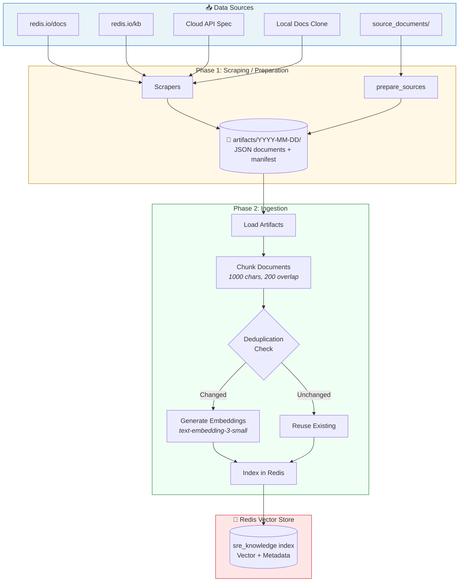

## Pipelines & Ingestion

The knowledge base pipeline has two distinct phases:

1. **Scraping/Preparation**: Collect documents and produce artifacts
2. **Ingestion**: Chunk artifacts, generate embeddings, and index in Redis

This separation allows you to prepare artifacts once (slow) and re-ingest them multiple times (fast) with different chunking strategies or embedding models.

---

## Pipeline Architecture



---

## Overview: How It Works

### Phase 1: Scraping/Preparation → Artifacts

Scrapers collect documents from various sources and save them as **artifacts** (JSON files) in `./artifacts/YYYY-MM-DD/` directories. Each artifact contains:
- Document content (markdown, text)
- Metadata (title, source URL, category, severity)
- Content hash (for deduplication)

**Available scrapers**:

- `redis_docs`: Scrape Redis documentation from redis.io (slow, downloads from web)
- `redis_docs_local`: Scrape Redis documentation from local clone (fast, recommended)
- `redis_runbooks`: Scrape Redis runbooks from redis.io
- `redis_kb`: Scrape Redis Knowledge Base articles from redis.io/kb with product labels
- `redis_cloud_api`: Scrape Redis Cloud API documentation from OpenAPI/Swagger spec
- `runbook_generator`: Generate runbooks from web sources using GPT-5
- User-added documents in `source_documents/` (via `prepare_sources`)

### Phase 2: Ingestion → Redis Vector Index

The ingestion pipeline processes artifacts and indexes them in Redis:

1. **Load artifacts** from `./artifacts/YYYY-MM-DD/`
2. **Chunk documents** using a strategy appropriate for technical documentation
3. **Generate embeddings** for each chunk (OpenAI `text-embedding-3-small`)
4. **Index in Redis** using RediSearch vector search

**Chunking strategy**:

- **Default**: 1000 characters per chunk, 200 character overlap
- **CLI/API docs**: Keep whole (up to 6KB for CLI, 12KB for API) to preserve command examples
- **Small docs**: Keep whole if under chunk size
- **Smart boundaries**: Break at sentence/word boundaries, not mid-word

This ensures CLI commands, API examples, and code blocks stay intact for better retrieval quality.

---

## Quick Start

### Option 1: Use Pre-downloaded Redis Docs (Recommended)

The fastest way to get started is to clone Redis docs locally and scrape from there:

```bash
# Download Redis docs (one-time setup)
./scripts/setup_redis_docs_local.sh

# This clones redis/docs repo and runs the scraper
# Artifacts saved to ./artifacts/YYYY-MM-DD/
```

Then ingest:

```bash
uv run redis-sre-agent pipeline ingest --latest-only
```

**Why `--latest-only`?** Skips versioned docs (7.4, 7.2, etc.) and only indexes the latest version. Without this flag, you'll index duplicate content across versions, making the knowledge base 3-5x larger.

### Option 2: Scrape from Web (Slower)

```bash
# Scrape Redis docs from redis.io
uv run redis-sre-agent pipeline scrape --scrapers redis_docs --latest-only

# Ingest the scraped artifacts
uv run redis-sre-agent pipeline ingest --latest-only
```

### Option 3: Full Pipeline (Scrape + Ingest)

```bash
# Run both phases in one command
uv run redis-sre-agent pipeline full --scrapers redis_docs_local --latest-only
```

---

## Working with User-Added Documents

The `source_documents/` directory contains LLM-generated runbooks for common Redis problems. You can modify, remove, or add to these documents.

### Directory Structure

```
source_documents/
├── cloud/              # Redis Cloud-specific runbooks
├── enterprise/         # Redis Enterprise-specific runbooks
├── oss/                # Redis OSS-specific runbooks
├── reference/          # Reference documentation (e.g., rladmin CLI)
└── shared/             # Runbooks applicable to all Redis deployments
```

### Prepare and Ingest User Documents

```bash
# Prepare artifacts from source_documents/
uv run redis-sre-agent pipeline prepare-sources \
    --source-dir ./source_documents \
    --prepare-only

# This creates artifacts in ./artifacts/YYYY-MM-DD/
# Then ingest them:
uv run redis-sre-agent pipeline ingest
```

Or do both in one step:

```bash
# Prepare and ingest in one command
uv run redis-sre-agent pipeline prepare-sources \
    --source-dir ./source_documents
```

### Adding Your Own Documents

1. Create a markdown file in the appropriate subdirectory:
   ```bash
   # Example: Add a custom runbook
   cat > source_documents/shared/my-custom-runbook.md <<EOF
   # My Custom Redis Runbook

   ## Problem
   Description of the issue...

   ## Solution
   Step-by-step resolution...
   EOF
   ```

2. Prepare and ingest:
   ```bash
   uv run redis-sre-agent pipeline prepare-sources
   ```

The document will be chunked, embedded, and indexed in Redis.

---

## Pipeline Commands Reference

### `scrape` - Collect Documents

```bash
uv run redis-sre-agent pipeline scrape \
    --scrapers redis_docs_local,redis_kb,redis_cloud_api \
    --latest-only \
    --artifacts-path ./artifacts
```

**Options**:
- `--scrapers`: Comma-separated list of scrapers to run
- `--latest-only`: Skip versioned docs (recommended)
- `--artifacts-path`: Where to save artifacts (default: `./artifacts`)

**Available scrapers**:
- `redis_docs`: Scrape from redis.io (slow, web download)
- `redis_docs_local`: Scrape from local clone (fast, recommended - use `./scripts/setup_redis_docs_local.sh`)
- `redis_runbooks`: Scrape runbooks from redis.io
- `redis_kb`: Scrape Knowledge Base articles from redis.io/kb (includes product labels: Cloud, Enterprise, OSS)
- `redis_cloud_api`: Scrape Redis Cloud API docs from OpenAPI/Swagger spec (REST API reference)
- `runbook_generator`: Generate runbooks from web sources using GPT-5

**Output**: Artifacts saved to `./artifacts/YYYY-MM-DD/`

### `ingest` - Index Artifacts in Redis

```bash
uv run redis-sre-agent pipeline ingest \
    --batch-date 2025-01-15 \
    --latest-only \
    --artifacts-path ./artifacts
```

**Options**:
- `--batch-date`: Which batch to ingest (default: today)
- `--latest-only`: Skip versioned docs during ingestion
- `--artifacts-path`: Where to find artifacts (default: `./artifacts`)

**Output**: Chunks indexed in Redis with embeddings

### `full` - Scrape + Ingest

```bash
uv run redis-sre-agent pipeline full \
    --scrapers redis_docs_local \
    --latest-only \
    --artifacts-path ./artifacts
```

Runs both scraping and ingestion in sequence.

### `prepare_sources` - User Documents → Artifacts

```bash
uv run redis-sre-agent pipeline prepare-sources \
    --source-dir ./source_documents \
    --batch-date 2025-01-15 \
    --prepare-only \
    --artifacts-path ./artifacts
```

**Options**:
- `--source-dir`: Directory containing markdown files (default: `source_documents`)
- `--batch-date`: Batch date for artifacts (default: today)
- `--prepare-only`: Only create artifacts, don't ingest
- `--artifacts-path`: Where to save artifacts (default: `./artifacts`)

### `status` - Show Pipeline Status

```bash
uv run redis-sre-agent pipeline status --artifacts-path ./artifacts
```

Shows:

- Available batches
- Scrapers configured
- Ingestion status

### `show_batch` - Batch Details

```bash
uv run redis-sre-agent pipeline show-batch \
    --batch-date 2025-01-15 \
    --artifacts-path ./artifacts
```

Shows detailed information about a specific batch:

- Document count by category
- Document types
- Ingestion status (if ingested)

### `cleanup` - Remove Old Batches

```bash
uv run redis-sre-agent pipeline cleanup \
    --keep-days 30 \
    --artifacts-path ./artifacts
```

Removes batch directories older than specified days.

---

## Advanced Topics

### Chunking Configuration

The chunking strategy is optimized for technical documentation with CLI commands and API examples. Default settings:

- **Chunk size**: 1000 characters
- **Chunk overlap**: 200 characters
- **Min chunk size**: 100 characters
- **Whole doc threshold**: 6000 characters (CLI docs)
- **Whole API threshold**: 12000 characters (API docs)

**Why these settings?**
- **Overlap** ensures context isn't lost at chunk boundaries
- **Whole doc thresholds** keep CLI commands and API examples intact
- **Smart boundaries** break at sentences/words, not mid-command

You can adjust these via the Knowledge API (see `docs/reference/api.md`).

### Embedding Model

Default: OpenAI `text-embedding-3-small` (1536 dimensions)

This model is:

- Fast and cost-effective
- Good quality for technical documentation
- Widely supported

To change the embedding model, update via the Knowledge API or environment variables.

### Deduplication

The pipeline uses content hashing for deduplication:

- **Document hash**: SHA-256 of content
- **Chunk hash**: SHA-256 of chunk content
- **Deterministic IDs**: `{document_hash}_{chunk_index}`

When re-ingesting:

- Unchanged chunks reuse existing embeddings (fast, no API calls)
- Changed chunks generate new embeddings
- Deleted chunks are removed from the index

This makes re-ingestion efficient and idempotent.

### Batch Artifacts Structure

Each batch is stored in `./artifacts/YYYY-MM-DD/`:

```
artifacts/2025-01-15/
├── manifest.json                    # Batch metadata
├── ingestion_manifest.json          # Ingestion results (if ingested)
├── redis_docs/                      # Documents by category
│   ├── doc_abc123.json
│   └── doc_def456.json
├── runbooks/
│   └── doc_ghi789.json
└── reference/
    └── doc_jkl012.json
```

**manifest.json** contains:

- Batch creation timestamp
- Total document count
- Document counts by category and type
- Scraper metadata

**ingestion_manifest.json** contains:

- Ingestion timestamp
- Documents processed
- Chunks created and indexed
- Errors (if any)

### Incremental Ingestion

You can ingest multiple batches into the same Redis index:

```bash
# Ingest batch 1
uv run redis-sre-agent pipeline ingest --batch-date 2025-01-15

# Ingest batch 2 (adds to existing index)
uv run redis-sre-agent pipeline ingest --batch-date 2025-01-16
```

Deduplication ensures the same document isn't indexed twice.

### Runbook Generation

The `runbook_generator` scraper uses GPT-5 to generate standardized runbooks from web sources:

```bash
# List configured URLs
uv run redis-sre-agent pipeline runbooks --list-urls

# Add a new URL and generate runbook
uv run redis-sre-agent pipeline runbooks \
    --url "https://redis.io/docs/latest/operate/rs/databases/memory-performance/"

# Test URL extraction (without generating runbook)
uv run redis-sre-agent pipeline runbooks \
    --test-url "https://redis.io/docs/latest/operate/rs/databases/memory-performance/"
```

Generated runbooks are saved to `./artifacts/YYYY-MM-DD/runbooks/`.

---

## Troubleshooting

### "No artifacts found for batch YYYY-MM-DD"

**Cause**: The batch directory doesn't exist or is empty.

**Solution**: Run `scrape` or `prepare_sources` first to create artifacts.

### "Ingestion failed: Redis connection error"

**Cause**: Can't connect to Redis.

**Solution**: Check `REDIS_URL` environment variable and Redis connectivity.

### "Embedding failed: OpenAI API error"

**Cause**: OpenAI API key is invalid or rate limited.

**Solution**:

- Check `OPENAI_API_KEY` environment variable
- Verify API key is valid
- Check OpenAI rate limits and quotas

### "Chunks indexed: 0"

**Cause**: All documents were filtered out or chunking failed.

**Solution**:
- Check `--latest-only` flag (may be filtering too aggressively)
- Review batch manifest to see what documents were scraped
- Check logs for chunking errors

### Artifacts directory is huge (>2GB)

**Cause**: Multiple batches accumulated over time.

**Solution**: Run cleanup to remove old batches:

```bash
uv run redis-sre-agent pipeline cleanup --keep-days 30
```

### Re-ingestion is slow

**Cause**: Generating embeddings for all chunks, even unchanged ones.

**Solution**: This shouldn't happen - deduplication should reuse embeddings. Check logs for "Reusing embedding for chunk" messages. If not present, there may be a bug.

---

## Best Practices

### 1. Use `--latest-only` for Redis Docs

Always use `--latest-only` when scraping or ingesting Redis docs to avoid duplicate content across versions:

```bash
uv run redis-sre-agent pipeline full --scrapers redis_docs_local --latest-only
```

### 2. Clone Redis Docs Locally

Use `./scripts/setup_redis_docs_local.sh` to clone Redis docs locally. This is much faster than scraping from the web and reduces load on redis.io.

### 3. Start Small, Verify Quality

Don't ingest everything at once. Start with a small batch and verify retrieval quality:

```bash
# Ingest just runbooks first
uv run redis-sre-agent pipeline scrape --scrapers runbook_generator
uv run redis-sre-agent pipeline ingest

# Test retrieval via API or CLI
uv run redis-sre-agent query "How do I troubleshoot memory pressure?"

# If quality is good, add more sources
```

### 4. Keep Batches Organized

Use meaningful batch dates and clean up old batches regularly:

```bash
# Use explicit batch dates for important ingestions
uv run redis-sre-agent pipeline prepare-sources \
    --batch-date 2025-01-15 \
    --source-dir ./custom_runbooks

# Clean up monthly
uv run redis-sre-agent pipeline cleanup --keep-days 30
```

### 5. Monitor Ingestion Results

Always check ingestion output for errors:

```bash
uv run redis-sre-agent pipeline ingest --batch-date 2025-01-15

# Look for:
# ✅ Chunks indexed: 12500  (good)
# ⚠️  Errors: 5             (investigate)
```

Use `show_batch` to see detailed results:

```bash
uv run redis-sre-agent pipeline show-batch --batch-date 2025-01-15
```

---

## See Also

- [Knowledge Base API](../reference/api.md) - Manage knowledge base via API
- [Configuration](../reference/configuration.md) - Environment variables and settings
- [Observability](../operations/observability.md) - Monitor ingestion performance
