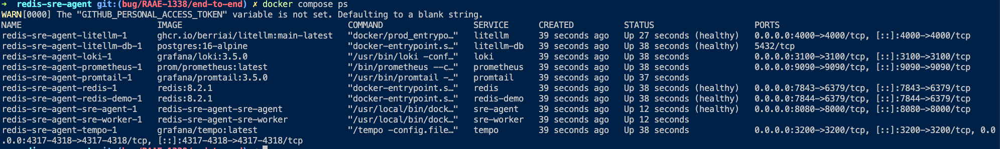
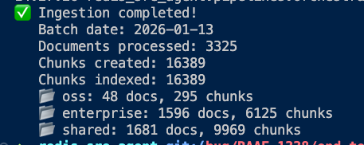

# Getting Started with the SRE Agent

## Prerequisites

- Docker
- Docker Compose
- OpenAI API key
- Python >= 3.12
- uv package manager

## Environment Setup

Copy the example environment file:

```bash
cp .env.example .env
```

Update the `.env` file to include your OpenAI key:

```bash
OPENAI_API_KEY=your_key
```

Generate a master key:

```bash
python -c 'import os, base64; print(base64.b64encode(os.urandom(32)).decode())'
```

Update the `.env` file to include the master key:

```bash
REDIS_SRE_MASTER_KEY=your_key
```

**Note:** The example environment file sets default models. If you are using newer models, confirm that they are available in the LiteLLM config at `/monitoring/litellm/config.yaml`.

## Docker Compose

Start the following services using Docker Compose:

```bash
docker compose up -d \
  redis redis-demo \
  sre-agent sre-worker \
  prometheus grafana \
  loki promtail
```

Here's what each service does:

- **redis**: The Redis instance used by the sre-agent and sre-worker
- **redis-demo**: The Redis instance that the sre-agent will monitor
- **sre-agent**: The SRE agent API
- **sre-worker**: The SRE agent worker
- **prometheus**: Prometheus instance for metrics
- **grafana**: Grafana instance for dashboards
- **loki**: Loki instance for log aggregation
- **promtail**: Promtail instance for log collection

**Note:** There are **two** Redis instances. One is used by the application itself, and the other is the Redis instance that the sre-agent will monitor.

### Status Checks

#### API

```bash
# Root health (fast)
# Use port 8080 for Docker Compose, port 8000 for local uvicorn
curl -fsS http://localhost:8080/

# Detailed health (Redis, vector index, workers)
curl -fsS http://localhost:8080/api/v1/health | jq

# Prometheus metrics (scrape this)
curl -fsS http://localhost:8080/api/v1/metrics | head -n 20
```

#### Docker

```bash
docker ps
```



#### Redis

Use Redis Insight or `redis-cli` to confirm that both Redis instances are running. By default, the internal SRE Redis is available at `redis://localhost:7843` and the redis-demo at `redis://localhost:7844`. The internal instance (port 7843) will have Docket workers and additional keys related to the sre-agent. The redis-demo instance will be empty.

## Populating the Knowledge Base and Running the UI

Populate the index locally (this may take a moment to generate embeddings):

```bash
uv run ./scripts/setup_redis_docs_local.sh

uv run redis-sre-agent pipeline ingest
```


Check the index to verify that documents were loaded:



### Run the SRE UI

```bash
docker compose up -d sre-ui
```

The UI should be available at http://localhost:3002 and look something like this:


**Note:** If you see connection issues, open the browser developer console and check that connections are being made to the correct ports. If the UI is attempting to connect to the wrong port, update `ui/.env` to include the correct port:

```bash
# In ui/.env, not the root-level .env
VITE_API_URL=http://localhost:8080/api/v1
```

## Adding an Instance

Create the instance that the agent will triage:

```bash
# Create instance
curl -fsS -X POST http://localhost:8080/api/v1/instances \
  -H 'Content-Type: application/json' \
  -d '{
    "name": "local-dev",
    "connection_url": "redis://redis-demo:6379/0",
    "environment": "dev",
    "usage": "cache",
    "description": "Primary Redis"
  }' | jq
```

## Summary

You now have a running version of the Redis SRE agent. You can ask it questions about Redis in the UI or via the API, and experiment with different configurations and settings.
