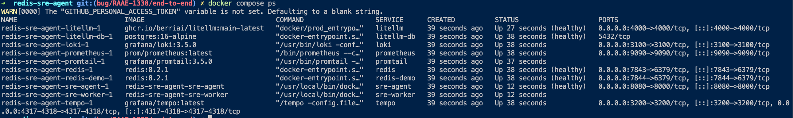
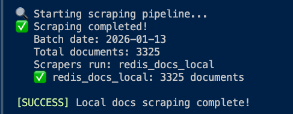
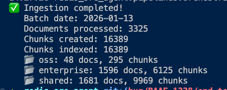
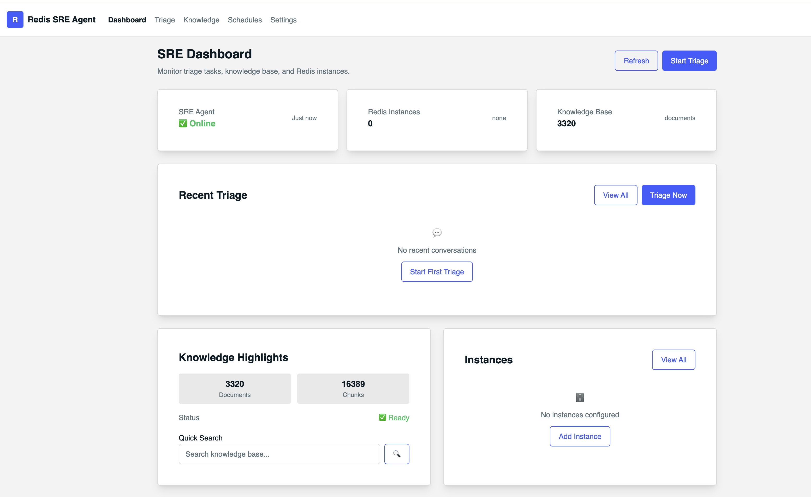

# Getting Started with the SRE Agent

## Prerequisites

- Docker
- Docker Compose
- OpenAI API key
- Python >= 3.12
- uv package manager

## Environment Setup

Copy the example environment file:

```bash
cp .env.example .env
```

Update the `.env` file to include your OpenAI key:

```bash
OPENAI_API_KEY=your_key
```

Generate master keys for the SRE agent and LiteLLM proxy:

```bash
python -c 'import os, base64; print("REDIS_SRE_MASTER_KEY=" + base64.b64encode(os.urandom(32)).decode())'
python -c 'import os, base64; print("LITELLM_MASTER_KEY=" + base64.b64encode(os.urandom(32)).decode())'
```

Copy the output and add both lines to your `.env` file.

**Note:** The example environment file sets default models. If you are using newer models, confirm that they are available in the LiteLLM config at `/monitoring/litellm/config.yaml`.

## Docker Compose

Start the services using Docker Compose:

```bash
docker compose up -d
```

Here's what each service does:

- **redis**: The Redis instance used by the sre-agent and sre-worker
- **redis-demo**: The Redis instance that the sre-agent will monitor
- **sre-agent**: The SRE agent API
- **sre-worker**: The SRE agent worker
- **sre-ui**: The web UI for interacting with the agent
- **litellm**: LLM proxy for OpenAI API calls
- **prometheus**: Prometheus instance for metrics
- **grafana**: Grafana instance for dashboards
- **loki**: Loki instance for log aggregation
- **promtail**: Promtail instance for log collection
- **tempo**: Distributed tracing backend

**Note:** There are **two** Redis instances. One is used by the application itself, and the other is the Redis instance that the sre-agent will monitor.

### Status Checks

#### API

```bash
# Root health (fast)
# Use port 8080 for Docker Compose, port 8000 for local uvicorn
curl -fsS http://localhost:8080/

# Detailed health (Redis, vector index, workers)
curl -fsS http://localhost:8080/api/v1/health | jq

# Prometheus metrics (scrape this)
curl -fsS http://localhost:8080/api/v1/metrics | head -n 20
```

#### Docker

```bash
docker ps
```



#### Redis

Use Redis Insight or `redis-cli` to confirm that both Redis instances are running. By default, the internal SRE Redis is available at `redis://localhost:7843` and the redis-demo at `redis://localhost:7844`. The internal instance (port 7843) will have Docket workers and additional keys related to the sre-agent. The redis-demo instance will be empty.

## Populating the Knowledge Base and Running the UI

Populate the index locally (this may take a moment to generate embeddings):

```bash
uv run ./scripts/setup_redis_docs_local.sh

uv run redis-sre-agent pipeline ingest
```



Check the index to verify that documents were loaded:



### SRE UI

The UI is started automatically with `docker compose up -d` and should be available at http://localhost:3002:



**Note:** If you see connection issues, open the browser developer console and check that connections are being made to the correct ports. If the UI is attempting to connect to the wrong port, update `ui/.env` to include the correct port:

```bash
# In ui/.env, not the root-level .env
VITE_API_URL=http://localhost:8080/api/v1
```

## Adding an Instance

Create the instance that the agent will triage. You can use the CLI (inside Docker) or the API:

### Using the CLI (recommended)

```bash
# Run the CLI command inside the sre-agent container
docker compose exec sre-agent redis-sre-agent instance create \
  --name local-dev \
  --connection-url "redis://redis-demo:6379/0" \
  --environment development \
  --usage cache \
  --description "Primary Redis"
```

### Using the API

```bash
# Create instance via API
curl -fsS -X POST http://localhost:8080/api/v1/instances \
  -H 'Content-Type: application/json' \
  -d '{
    "name": "local-dev",
    "connection_url": "redis://redis-demo:6379/0",
    "environment": "development",
    "usage": "cache",
    "description": "Primary Redis"
  }' | jq
```

**Note:** The `environment` field must be one of: `development`, `staging`, `production`, or `test`.

### Using the UI

Navigate to http://localhost:3002 and use the Instances page to add a new instance.

## Querying the Agent

You can query the agent via CLI, UI, or API.

**Note:** When using Docker Compose, CLI commands should be run inside the container to access Docker-internal hostnames like `redis-demo`. Use `docker compose exec` as shown below. Alternatively, for local development with `uv run`, update instance connection URLs to use `localhost` ports.

### Query target rules

New `query` turns must include exactly one target: `-r <instance-id>` or `-c <cluster-id>`.  
When continuing with `-t <thread-id>`, you can omit the target (reuse thread context) or pass a matching compatible target.

For unscoped documentation lookups, use:

```bash
docker compose exec sre-agent redis-sre-agent knowledge search --query "Redis eviction policies"
```

### Knowledge-style queries (target scoped)

Ask general Redis questions through the knowledge agent while still scoping the thread:

```bash
# Explicitly use the knowledge agent
docker compose exec sre-agent redis-sre-agent query -r <instance-id> --agent knowledge "How do I configure Redis persistence?"
```

### Instance-specific queries

First, list available instances to get the instance ID:

```bash
docker compose exec sre-agent redis-sre-agent instance list
```

Then query with the instance ID:

```bash
# Quick diagnostic (chat agent)
docker compose exec sre-agent redis-sre-agent query -r <instance-id> "What's the current memory usage?"

# Full health check (triage agent)
docker compose exec sre-agent redis-sre-agent query -r <instance-id> --agent triage "Run a full health check"

# Investigate slow queries
docker compose exec sre-agent redis-sre-agent query -r <instance-id> "Are there any slow queries?"
```

### Multi-turn conversations

Continue a conversation using the thread ID returned from a previous query:

```bash
# Start a conversation
docker compose exec sre-agent redis-sre-agent query -r <instance-id> "What's the memory usage?"
# Output includes: Thread ID: abc123...

# Continue the conversation
docker compose exec sre-agent redis-sre-agent query -t abc123 "What about CPU?"
```

### Agent selection

The agent is auto-selected based on your query, or specify explicitly:

| Agent | Use case | Target required for new turns |
|-------|----------|-------------------------------|
| `knowledge` | General Redis questions, best practices | Yes (`instance_id` or `cluster_id`) |
| `chat` | Quick instance diagnostics | Yes (`instance_id` or `cluster_id`) |
| `triage` | Full health checks, deep analysis | Yes (`instance_id` or `cluster_id`) |
| `auto` | Let the router decide (default) | Yes (`instance_id` or `cluster_id`) |

## Summary

You now have a running version of the Redis SRE agent. You can ask it questions about Redis via the CLI, UI, or API, and experiment with different configurations and settings.
